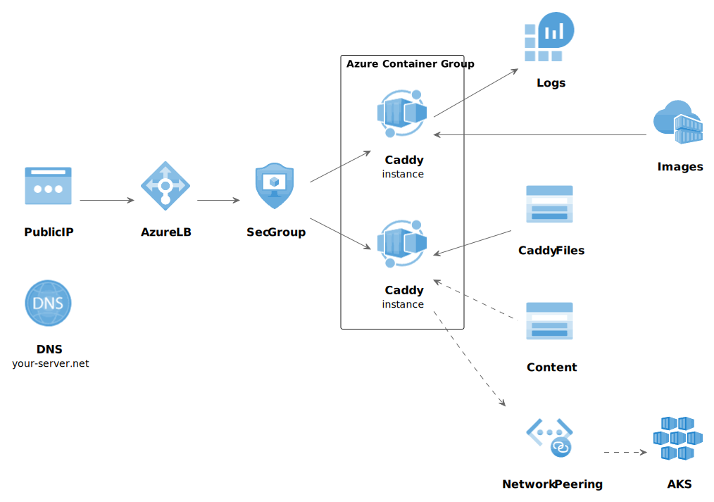

= Caddy as an Azure Firewall

Are you running services in Azure? Ever longed for a stable and secure firewall that doesn't cost a kidney? What if I tell you, you can run a reduntant and load balanced, super secure firewall capable of managing high volumes of traffic, for peanut money?

Say hello to link:https://coraza.io/[Coraza], An OWASP Core Ruleset firewall based on link:https://caddyserver.com/[Caddy server].

In this article I will guide you through setting up:

 * A public IP for external access
 * Load balancing with strict IP rules for incoming traffic
 * One to many (1-n) Caddy Coraza instances serving incoming traffic
 * Direct file access from a shared Azure Blob Storage
 * Reverse proxying to other services you have running
 * Continuous HTTPS with help of Caddy's powerful features

And we will do all of this with OpenTofu or Terraform! 

Hey! Why are you using Terraform and not link:https://opentofu.org/[OpenTofu]?! Simply because I was using TF before the licensing conflict started. I do have an intention to migrate to OpenTofu, but I am quite heavily invested into TF and time is precious. With this article I am 100 % sure you are able to convert this to OpenTofu on your own! 

== The Setup

What you need to follow suit:

* Azure Account. Will it work with some free tier account? No idea, I pay for premium stuff
* Opentofu or Terraform and know how
* The AZ-CLI, used to authenticate tofu/tf against Azure

== Estimated Azure Costs

While costs are not static in a cloud environment and are different depending on regions, this setup has been running in multiple environments for a few years and the monthly cost is pretty solid. The entire installation is also created within its own resource group which makes it easy to track costs specifically for the firewall.

Here is a rough estimate on costs, rounded average from months during 2024. 

[cols="4,1"]
|===
|Azure Thingy
|Average Monthly Cost

|Caddy instance 1
|€ 41

|Caddy instance 2
|€ 41

|Storage Account for instances
|€ 36

|Load balancer
|€ 18

|Public IP
|€ 4

|Log Analytics
|€ 1?..

|*Rough Total*
|*€ 114*

|===

The cost of the storage account is fluctuating the most, some months it has been doubled and it is mostly writes to the storage that affects the price. Regardless, I haven't seen any panic peak of costs so far and no month have been above € 180 with this setup. Note, this setup is in use in multiple European Azure regions, your mileage may vary. 

You _can_ actually go with lower resources on the containers, but as I host quite a lot of endpoints with FW rules enabled on all of them, a reload of config goes faster with a bit more memory. If you do this for a hobby installation, you can definitely escape with less resources. If you are not worried about redundancy (Caddy is very reliable as is) you could even go with only one container instance to begin with and scale up later.

As a matter of fact, this is a very reliable and cheap way of running Docker containers in Azure with a public IP, even if it's only one container. And if you get away with an IPv6 address, there is no cost for the address at all.

== Let's do it!

Everything below can be found in the link:https://github.com/svenakela/caddy-coraza-in-azure[Caddy Coraza in Azure] repository.

WARNING: You need Opentofu/Terraform and Azure knowledge to get going. Setting up your environment is beyond this guide. To continue with this setup your Tofu/TF environment should already be authenticated with link:https://registry.terraform.io/providers/hashicorp/azurerm/latest/docs/guides/azure_cli.html[Azure Cli].

=== Preparation - Create a State File

NOTE: If you already have a state file this step is not needed.

OK, first of *you should not* keep your state file locally! Let's begin with setting up a Blob Storage to keep the state file safe in your Azure account, this will also make it possible for several people to do devops work within the same configuration.

This is a pre-step and we don't want to incorporate this step in the rest of the config. The state file configuration is sensitive and should be its own isolated little island to avoid being overwritten by mistake.

==== The Resource Group Module

Create a `modules/resourcegroup` directory. Create the files 

* link:https://github.com/svenakela/caddy-coraza-in-azure/blob/main/modules/resourcegroup/main.tf[`main.tf` with content here]
* link:https://github.com/svenakela/caddy-coraza-in-azure/blob/main/modules/resourcegroup/output.tf[`output.tf` with content here]
* link:https://github.com/svenakela/caddy-coraza-in-azure/blob/main/modules/resourcegroup/variables.tf[`variables.tf` with content here]

==== The State Storage

Create a `modules/tfstatestorage` directory. Create the files

* link:https://github.com/svenakela/caddy-coraza-in-azure/blob/main/modules/tfstatestorage/main.tf[`main.tf` with content here]
* link:https://github.com/svenakela/caddy-coraza-in-azure/blob/main/modules/tfstatestorage/output.tf[`output.tf` with content here]
* link:https://github.com/svenakela/caddy-coraza-in-azure/blob/main/modules/tfstatestorage/providers.tf[`providers.tf` with content here]

In `main.tf` there are some changes to do:
[source, terraform]
----
# main.tf
module "resourcegroup" {
  source = "../resourcegroup"
  resource_group_name_prefix = "rg-mysuperspecial-statestorage"
}
----
The prefix will be combined with a random pet name to make sure that the resource group has a unique name within your account. Change the prefix accordingly.

[source, terraform]
----
# main.tf
resource "azurerm_storage_account_network_rules" "tfstate" {
  storage_account_id    = azurerm_storage_account.tfstate.id
  default_action        = "Deny"
  ip_rules              = ["ADD-YOUR-HOME-OR-OFFICE-PUBLIC-IP-ADDRESS-HERE-FOR-REDUCED-ACCESS"]
}
----
The `ip_rules` config limits the access to the storage. If you are working from a fixed IP address add it here to make the storage less exposed. In my Azure accounts such storage is restricted down further to specific devops users and only those users can reach the state file, i.e. only a handful of users can execute the changes.

==== Plan and Apply

Open up a terminal and go to the `modules/tfstatestorage` directory. Initialize and apply the plan:
[source, bash]
----
$ cd modules/tfstatestorage
$ tofu init
$ tofu plan
$ tofu apply --auto-approve

...

Apply complete! Resources: 6 added, 0 changed, 0 destroyed.

Outputs:

container_id = "https://buyskwliprnh.blob.core.windows.net/tfstates"
container_name = "tfstates"
storage_account_id = "/subscriptions/1ad31abc-...-2ad7f10adf/resourceGroups/rg-mysuperspecial-statestorage-engaged-humpback/providers/Microsoft.Storage/storageAccounts/buyskwliprnh"
storage_account_name = "buyskwliprnh"
----

This will create the state storage. Copy the output, we need it!

In the root directory, setup a link:https://github.com/svenakela/caddy-coraza-in-azure/blob/main/providers.tf[`providers.tf`] and use the output from the state storage above to fill in the config:

[source, terraform]
----
  backend "azurerm" {
    resource_group_name = "rg-mysuperspecial-statestorage-engaged-humpback"
    storage_account_name = "buyskwliprnh"
    container_name       = "tfstates"
    key                  = "caddy-in-azure.tfstate" // MUST be unique!
  }

provider "azurerm" {
  features {}
  subscription_id = "1ad31abc-...-2ad7f10adf"
}
----
You can re-use the state storage for many state files and if you do it is very important that the `key` file name is changed for each config! If there are two different configs with the same state file, you will end up in horrible conflicts.

In the terminal go to the root directory of the project and apply:
[source, bash]
----
$ tofu init

...
OpenTofu has been successfully initialized!
...
----

You should now have a state file named `caddy-in-azure.tfstate` in the Blob Storage, and you are ready to go with the real WAF configuration!

